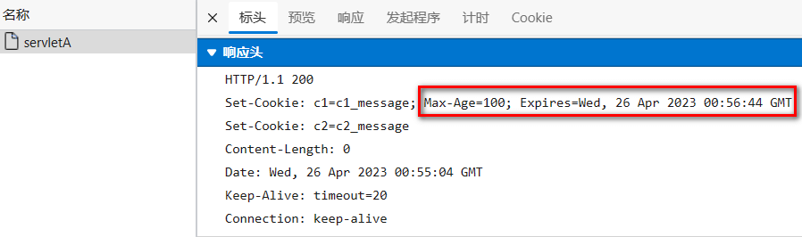

## 1. 会话

### 1.1. 会话管理概述

#### 1.1.1. 为什么需要会话管理

> HTTP 是无状态协议

- 无状态就是不保存状态,即无状态协议(stateless),HTTP 协议自身不对请求和响应之间的通信状态进行保存,也就是说,在 HTTP 协议这个级别,协议对于发送过的请求或者响应都不做持久化处理
- 简单理解:浏览器发送请求,服务器接收并响应,但是服务器不记录请求是否来自哪个浏览器,服务器没记录浏览器的特征,就是客户端的状态

> 举例: 张三去一家饭馆点了几道菜,觉得味道不错,第二天又去了,对老板说,还点上次的那几道菜

- 无状态: 老板没有记录张三是否来过,更没有记录上次他点了那些菜,张三只能重新再点一遍
- 有状态: 老板把每次来吃饭的用户都做好记录,查阅一下之前的记录,查到了张三之前的菜单,直接下单

#### 1.1.2. 会话管理实现的手段

> Cookie 和 Session 配合解决

- cookie 是在客户端保留少量数据的技术,主要通过响应头向客户端响应一些客户端要保留的信息
- session 是在服务端保留更多数据的技术,主要通过 HttpSession 对象保存一些和客户端相关的信息
- cookie 和 session 配合记录请求状态

> 举例: 张三去银行办业务

- 张三第一次去某个银行办业务,银行会为张三开户(Session),并向张三发放一张银行卡(cookie)
- 张三后面每次去银行,就可以携带之间的银行卡(cookie),银行根据银行卡找到之前张三的账户(session)

### 1.2. Cookie

#### 1.2.1. Cookie 概述

> cookie 是一种客户端会话技术,cookie 由服务端产生,它是服务器存放在浏览器的一小份数据,浏览器以后每次访问该服务器的时候都会将这小份数据携带到服务器去。

- 服务端创建 cookie,将 cookie 放入响应对象中,Tomcat 容器将 cookie 转化为 set-cookie 响应头,响应给客户端
- 客户端在收到 cookie 的响应头时,在下次请求该服务的资源时,会以 cookie 请求头的形式携带之前收到的 Cookie
- cookie 是一种键值对格式的数据,从 tomcat8.5 开始可以保存中文,但是不推荐
- 由于 cookie 是存储于客户端的数据,比较容易暴露,一般不存储一些敏感或者影响安全的数据

> 原理图


> 应用场景举例

1. 记录用户名

   当我们在用户名的输入框中输入完用户名后,浏览器记录用户名,下一次再访问登录页面时,用户名自动填充到用户名的输入框.

2. 保存电影播放进度

   在网页上播放电影的时候,如果中途退出浏览器了,下载再打开浏览器播放同一部电影的时候,会自动跳转到上次退出时候的进度,因为在播放的时候会将播放进度保存到 cookie 中

#### 1.2.2. Cookie 的使用

> servletA 向响应中增加 Cookie

```java
@WebServlet("/servletA")
public class ServletA extends HttpServlet {
    @Override
    protected void service(HttpServletRequest req, HttpServletResponse resp) throws ServletException, IOException {
        // 创建Cookie
        Cookie cookie1 =new Cookie("c1","c1_message");
        Cookie cookie2 =new Cookie("c2","c2_message");
        // 将cookie放入响应对象
        resp.addCookie(cookie1);
        resp.addCookie(cookie2);
    }
}
```


> servletB 从请求中读取 Cookie

```java
@WebServlet("/servletB")
public class ServletB extends HttpServlet {
    @Override
    protected void service(HttpServletRequest req, HttpServletResponse resp) throws ServletException, IOException {
        //获取请求中的cookie
        Cookie[] cookies = req.getCookies();
        //迭代cookies数组
        if (null != cookies && cookies.length!= 0) {
            for (Cookie cookie : cookies) {
                System.out.println(cookie.getName()+":"+cookie.getValue());
            }
        }
    }
}
```


#### 1.2.3. Cookie 的时效性

> 默认情况下 Cookie 的有效期是一次会话范围内，我们可以通过 cookie 的 setMaxAge()方法让 Cookie 持久化保存到浏览器上

- 会话级 Cookie
  - 服务器端并没有明确指定 Cookie 的存在时间
  - 在浏览器端，Cookie 数据存在于内存中
  - 只要浏览器还开着，Cookie 数据就一直都在
  - 浏览器关闭，内存中的 Cookie 数据就会被释放
- 持久化 Cookie
  - 服务器端明确设置了 Cookie 的存在时间
  - 在浏览器端，Cookie 数据会被保存到硬盘上
  - Cookie 在硬盘上存在的时间根据服务器端限定的时间来管控，不受浏览器关闭的影响
  - 持久化 Cookie 到达了预设的时间会被释放

> cookie.setMaxAge(int expiry)参数单位是秒，表示 cookie 的持久化时间，如果设置参数为 0，表示将浏览器中保存的该 cookie 删除

- servletA 设置一个 Cookie 为持久化 cookie

```java
@WebServlet("/servletA")
public class ServletA extends HttpServlet {
    @Override
    protected void service(HttpServletRequest req, HttpServletResponse resp) throws ServletException, IOException {
        // 创建Cookie
        Cookie cookie1 =new Cookie("c1","c1_message");
        cookie1.setMaxAge(60);
        Cookie cookie2 =new Cookie("c2","c2_message");
        // 将cookie放入响应对象
        resp.addCookie(cookie1);
        resp.addCookie(cookie2);
    }
}
```



- servletB 接收 Cookie,浏览器中间发生一次重启再请求 servletB 测试

```java
@WebServlet("/servletB")
public class ServletB extends HttpServlet {
    @Override
    protected void service(HttpServletRequest req, HttpServletResponse resp) throws ServletException, IOException {
        //获取请求中的cookie
        Cookie[] cookies = req.getCookies();
        //迭代cookies数组
        if (null != cookies && cookies.length!= 0) {
            for (Cookie cookie : cookies) {
                System.out.println(cookie.getName()+":"+cookie.getValue());
            }
        }
    }
}
```


#### 1.2.4. Cookie 的提交路径

> 访问互联网资源时不能每次都需要把所有 Cookie 带上。访问不同的资源时,可以携带不同的 cookie,我们可以通过 cookie 的 setPath(String path) 对 cookie 的路径进行设置

- 从 ServletA 中获取 cookie

```java
public class ServletA extends HttpServlet {
    @Override
    protected void service(HttpServletRequest req, HttpServletResponse resp) throws ServletException, IOException {
        // 创建Cookie
        Cookie cookie1 =new Cookie("c1","c1_message");
        // 设置cookie的提交路径
        cookie1.setPath("/web03_war_exploded/servletB");
        Cookie cookie2 =new Cookie("c2","c2_message");
        // 将cookie放入响应对象
        resp.addCookie(cookie1);
        resp.addCookie(cookie2);
    }
}

```


- 向 ServletB 请求时携带携带了 c1


- 向其他资源请求时就不携带 c1 了


### 1.3. Session

#### 1.3.1. HttpSession 概述

> HttpSession 是一种保留更多信息在服务端的一种技术,服务器会为每一个客户端开辟一块内存空间,即 session 对象. 客户端在发送请求时,都可以使用自己的 session. 这样服务端就可以通过 session 来记录某个客户端的状态了

- 服务端在为客户端创建 session 时,会同时将 session 对象的 id,即 JSESSIONID 以 cookie 的形式放入响应对象
- 后端创建完 session 后,客户端会收到一个特殊的 cookie,叫做 JSESSIONID
- 客户端下一次请求时携带 JSESSIONID,后端收到后,根据 JSESSIONID 找到对应的 session 对象
- 通过该机制,服务端通过 session 就可以存储一些专门针对某个客户端的信息了
- session 也是域对象(后续详细讲解)

> 原理图如下


> 应用场景

1. 记录用户的登录状态

   用户登录后,将用户的账号等敏感信息存入 session

2. 记录用户操作的历史

   例如记录用户的访问痕迹,用户的购物车信息等临时性的信息

#### 1.3.2. HttpSession 的使用

> 用户提交 form 表单到 ServletA,携带用户名,ServletA 获取 session 将用户名存到 Session,用户再请求其他任意 Servlet,获取之间存储的用户

- 定义表单页,提交用户名,提交后

```html
<form action="servletA" method="post">
  用户名:
  <input type="text" name="username" />
  <input type="submit" value="提交" />
</form>
```

- 定义 ServletA,将用户名存入 session

```java
@WebServlet("/servletA")
public class ServletA extends HttpServlet {
    @Override
    protected void service(HttpServletRequest req, HttpServletResponse resp) throws ServletException, IOException {
        // 获取请求中的参数
        String username = req.getParameter("username");
        // 获取session对象
        HttpSession session = req.getSession();
         // 获取Session的ID
        String jSessionId = session.getId();
        System.out.println(jSessionId);
        // 判断session是不是新创建的session
        boolean isNew = session.isNew();
        System.out.println(isNew);
        // 向session对象中存入数据
        session.setAttribute("username",username);

    }
}
```

- 响应中收到了一个 JSESSIONID 的 cookie


- 定义其他 Servlet,从 session 中读取用户名

```java
@WebServlet("/servletB")
public class ServletB extends HttpServlet {
    @Override
    protected void service(HttpServletRequest req, HttpServletResponse resp) throws ServletException, IOException {
        // 获取session对象
        HttpSession session = req.getSession();
         // 获取Session的ID
        String jSessionId = session.getId();
        System.out.println(jSessionId);
        // 判断session是不是新创建的session
        boolean isNew = session.isNew();
        System.out.println(isNew);
        // 从session中取出数据
        String username = (String)session.getAttribute("username");
        System.out.println(username);
    }
}
```

- 请求中携带了一个 JSESSIONID 的 cookie


> getSession 方法的处理逻辑


#### 1.3.3. HttpSession 时效性

> 为什么要设置 session 的时效

- 用户量很大之后，Session 对象相应的也要创建很多。如果一味创建不释放，那么服务器端的内存迟早要被耗尽。
- 客户端关闭行为无法被服务端直接侦测,或者客户端较长时间不操作也经常出现,类似这些的情况,就需要对 session 的时限进行设置了

> 默认的 session 最大闲置时间(两次使用同一个 session 中的间隔时间) 在 tomcat/conf/web.xml 配置为 30 分钟


> 我们可以自己在当前项目的 web.xml 对最大闲置时间进行重新设定


> 也可以通过 HttpSession 的 API 对最大闲置时间进行设定

```java
// 设置最大闲置时间
session.setMaxInactiveInterval(60);
```

> 也可以直接让 session 失效

```java
// 直接让session失效
session.invalidate();
```

### 1.4. 三大域对象

#### 1.4.1. 域对象概述

> 域对象: 一些用于存储数据和传递数据的对象,传递数据不同的范围,我们称之为不同的域,不同的域对象代表不同的域,共享数据的范围也不同

- web 项目中,我们一定要熟练使用的域对象分别是 请求域,会话域,应用域
- 请求域对象是 HttpServletRequest ,传递数据的范围是一次请求之内及请求转发
- 会话域对象是 HttpSession,传递数据的范围是一次会话之内,可以跨多个请求
- 应用域对象是 ServletContext,传递数据的范围是本应用之内,可以跨多个会话

> 生活举例: 热水器摆放位置不同,使用的范围就不同

1. 摆在张三工位下,就只有张三一个人能用
2. 摆在办公室的公共区,办公室内的所有人都可以用
3. 摆在楼层的走廊区,该楼层的所有人都可以用

> 三大域对象的数据作用范围图解

- 请求域


- 会话域


- 应用域


- 所有域在一起


#### 1.4.2. 域对象的使用

> 域对象的 API

| API                                         | 功能                    |
| ------------------------------------------- | ----------------------- |
| void setAttribute(String name,String value) | 向域对象中添加/修改数据 |
| Object getAttribute(String name);           | 从域对象中获取数据      |
| removeAttribute(String name);               | 移除域对象中的数据      |

> API 测试

- ServletA 向三大域中放入数据

```java
@WebServlet("/servletA")
public class ServletA extends HttpServlet {
    @Override
    protected void service(HttpServletRequest req, HttpServletResponse resp) throws ServletException, IOException {
        // 向请求域中放入数据
        req.setAttribute("request","request-message");
        //req.getRequestDispatcher("servletB").forward(req,resp);
        // 向会话域中放入数据
        HttpSession session = req.getSession();
        session.setAttribute("session","session-message");
        // 向应用域中放入数据
        ServletContext application = getServletContext();
        application.setAttribute("application","application-message");

    }
}

```

- ServletB 从三大域中取出数据

```java
@WebServlet("/servletB")
public class ServletB extends HttpServlet {
    @Override
    protected void service(HttpServletRequest req, HttpServletResponse resp) throws ServletException, IOException {
        // 从请求域中获取数据
        String reqMessage =(String)req.getAttribute("request");
        System.out.println(reqMessage);

        // 从会话域中获取数据
        HttpSession session = req.getSession();
        String sessionMessage =(String)session.getAttribute("session");
        System.out.println(sessionMessage);
        // 从应用域中获取数据
        ServletContext application = getServletContext();
        String applicationMessage =(String)application.getAttribute("application");
        System.out.println(applicationMessage);
    }
}
```

- 请求转发时，请求域可以传递数据`请求域内一般放本次请求业务有关的数据，如：查询到的所有的部门信息`
- 同一个会话内，不用请求转发，会话域可以传递数据`会话域内一般放本次会话的客户端有关的数据，如：当前客户端登录的用户`
- 同一个 APP 内，不同的客户端，应用域可以传递数据`应用域内一般放本程序应用有关的数据 如：Spring 框架的 IOC 容器`

## 2. 过滤器

### 2.1. 过滤器概述

> Filter,即过滤器,是 JAVAEE 技术规范之一,作用目标资源的请求进行过滤的一套技术规范,是 Java Web 项目中`最为实用的技术之一`

- Filter 接口定义了过滤器的开发规范，所有的过滤器都要实现该接口
- Filter 的工作位置是项目中所有目标资源之前，容器在创建 HttpServletRequest 和 HttpServletResponse 对象后，会先调用 Filter 的 doFilter 方法
- Filter 的 doFilter 方法可以控制请求是否继续，如果放行，则请求继续，如果拒绝，则请求到此为止，由过滤器本身做出响应
- Filter 不仅可以对请求做出过滤，也可以在目标资源做出响应前，对响应再次进行处理
- Filter 是 GOF 中责任链模式的典型案例
- Filter 的常用应用包括但不限于: 登录权限检查，解决网站乱码，过滤敏感字符，日志记录，性能分析... ...

> 生活举例: 公司前台,停车场安保,地铁验票闸机

- 公司前台对来访人员进行审核,如果是游客则拒绝进入公司,如果是客户则放行 . 客户离开时提醒客户不要遗忘物品
- 停车场保安对来访车辆进行控制,如果没有车位拒绝进入,如果有车位,发放停车卡并放行,车辆离开时收取请车费
- 地铁验票闸机在人员进入之前检查票,没票拒绝进入,有票验票后放行,人员离开时同样验票

> 过滤器开发中应用的场景

- 日志的记录
- 性能的分析
- 乱码的处理
- 事务的控制
- 登录的控制
- 跨域的处理
- ... ...

> 过滤器工作位置图解


> Filter 接口 API

- 源码

```java
package jakarta.servlet;
import java.io.IOException;

public interface Filter {
    default public void init(FilterConfig filterConfig) throws ServletException {
    }
    public void doFilter(ServletRequest request, ServletResponse response, FilterChain chain)
            throws IOException, ServletException;
    default public void destroy() {
    }
}

```

- API 目标

| API                                                                                       | 目标                                                                     |
| ----------------------------------------------------------------------------------------- | ------------------------------------------------------------------------ |
| default public void init(FilterConfig filterConfig)                                       | 初始化方法,由容器调用并传入初始配置信息 filterConfig 对象                |
| public void doFilter(ServletRequest request, ServletResponse response, FilterChain chain) | 过滤方法,核心方法,过滤请求,决定是否放行,响应之前的其他处理等都在该方法中 |
| default public void destroy()                                                             | 销毁方法,容器在回收过滤器对象之前调用的方法                              |

### 2.2. 过滤器使用

> 目标:开发一个日志记录过滤器

- 用户请求到达目标资源之前,记录用户的请求资源路径
- 响应之前记录本次请求目标资源运算的耗时
- 可以选择将日志记录进入文件,为了方便测试,这里将日志直接在控制台打印

> 定义一个过滤器类,编写功能代码

```java
package com.atguigu.filters;


import jakarta.servlet.*;
import jakarta.servlet.annotation.WebFilter;
import jakarta.servlet.http.HttpServletRequest;
import jakarta.servlet.http.HttpServletResponse;

import java.io.IOException;
import java.text.SimpleDateFormat;
import java.util.Date;
public class LoggingFilter  implements Filter {

    private SimpleDateFormat dateFormat =new SimpleDateFormat("yyyy-MM-dd HH:mm:ss");
    @Override
    public void doFilter(ServletRequest servletRequest, ServletResponse servletResponse, FilterChain filterChain) throws IOException, ServletException {
        // 参数父转子
        HttpServletRequest request =(HttpServletRequest)  servletRequest;
        HttpServletResponse  response =(HttpServletResponse)  servletResponse;
        // 拼接日志文本
        String requestURI = request.getRequestURI();
        String time = dateFormat.format(new Date());
        String beforeLogging =requestURI+"在"+time+"被请求了";
        // 打印日志
        System.out.println(beforeLogging);
        // 获取系统时间
        long t1 = System.currentTimeMillis();
        // 放行请求
        filterChain.doFilter(request,response);
        // 获取系统时间
        long t2 = System.currentTimeMillis();
        //  拼接日志文本
        String afterLogging =requestURI+"在"+time+"的请求耗时:"+(t2-t1)+"毫秒";
        // 打印日志
        System.out.println(afterLogging);

    }
}

```

- 说明
  - doFilter 方法中的请求和响应对象是以父接口的形式声明的,实际传入的实参就是 HttpServletRequest 和 HttpServletResponse 子接口级别的,可以安全强转
  - filterChain.doFilter(request,response); 这行代码的功能是放行请求,如果没有这一行代码,则请求到此为止
  - filterChain.doFilter(request,response);在放行时需要传入 request 和 response,意味着请求和响应对象要继续传递给后续的资源,这里没有产生新的 request 和 response 对象

> 定义两个 Servlet 作为目标资源

- ServletA

```java
@WebServlet(urlPatterns = "/servletA",name = "servletAName")
public class ServletA extends HttpServlet {
    @Override
    protected void service(HttpServletRequest req, HttpServletResponse resp) throws ServletException, IOException {
        // 处理器请求
        System.out.println("servletA处理请求的方法,耗时10毫秒");
        // 模拟处理请求耗时
        try {
            Thread.sleep(10);
        } catch (InterruptedException e) {
            throw new RuntimeException(e);
        }

    }
}
```

- ServletB

```java
@WebServlet(urlPatterns = "/servletB", name = "servletBName")
public class ServletB extends HttpServlet {
    @Override
    protected void service(HttpServletRequest req, HttpServletResponse resp) throws ServletException, IOException {
        // 处理器请求
        System.out.println("servletB处理请求的方法,耗时15毫秒");
        // 模拟处理请求耗时
        try {
            Thread.sleep(15);
        } catch (InterruptedException e) {
            throw new RuntimeException(e);
        }
    }
}

```

> 配置过滤器以及过滤器的过滤范围

- web.xml

```xml
<?xml version="1.0" encoding="UTF-8"?>
<web-app xmlns="https://jakarta.ee/xml/ns/jakartaee"
         xmlns:xsi="http://www.w3.org/2001/XMLSchema-instance"
         xsi:schemaLocation="https://jakarta.ee/xml/ns/jakartaee https://jakarta.ee/xml/ns/jakartaee/web-app_5_0.xsd"
         version="5.0">

    <!--配置filter,并为filter起别名-->
   <filter>
       <filter-name>loggingFilter</filter-name>
       <filter-class>com.atguigu.filters.LoggingFilter</filter-class>
   </filter>
    <!--为别名对应的filter配置要过滤的目标资源-->
    <filter-mapping>
        <filter-name>loggingFilter</filter-name>
        <!--通过映射路径确定过滤资源-->
        <url-pattern>/servletA</url-pattern>
        <!--通过后缀名确定过滤资源-->
        <url-pattern>*.html</url-pattern>
        <!--通过servlet别名确定过滤资源-->
        <servlet-name>servletBName</servlet-name>

    </filter-mapping>
</web-app>
```

- 说明

  - filter-mapping 标签中定义了过滤器对那些资源进行过滤
  - 子标签 url-pattern 通过映射路径确定过滤范围
    - /servletA 精确匹配,表示对 servletA 资源的请求进行过滤
    - \*.html 表示对以 `.action` 结尾的路径进行过滤
    - /\* 表示对所有资源进行过滤
    - 一个 filter-mapping 下可以配置多个 url-pattern
  - 子标签 servlet-name 通过 servlet 别名确定对那些 servlet 进行过滤
    - 使用该标签确定目标资源的前提是 servlet 已经起了别名
    - 一个 filter-mapping 下可以定义多个 servlet-name
    - 一个 filter-mapping 下，servlet-name 和 url-pattern 子标签可以同时存在

> 过滤过程图解


### 2.3. 过滤器生命周期

> 过滤器作为 web 项目的组件之一，和 Servlet 的生命周期类似，略有不同，没有 servlet 的 load-on-startup 的配置，默认就是系统启动立刻构造

| 阶段       | 对应方法                                                                                               | 执行时机       | 执行次数 |
| ---------- | ------------------------------------------------------------------------------------------------------ | -------------- | -------- |
| 创建对象   | 构造器                                                                                                 | web 应用启动时 | 1        |
| 初始化方法 | void init(FilterConfig filterConfig)                                                                   | 构造完毕       | 1        |
| 过滤请求   | void doFilter(ServletRequest servletRequest, ServletResponse servletResponse, FilterChain filterChain) | 每次请求       | 多次     |
| 销毁       | default void destroy()                                                                                 | web 应用关闭时 | 1 次     |

> 测试代码

```java
package com.atguigu.filters;

import jakarta.servlet.*;
import jakarta.servlet.annotation.WebServlet;

import java.io.IOException;


@WebServlet("/*")
public class LifeCycleFilter implements Filter {
    public LifeCycleFilter(){
        System.out.println("LifeCycleFilter constructor method invoked");
    }

    @Override
    public void init(FilterConfig filterConfig) throws ServletException {
        System.out.println("LifeCycleFilter init method invoked");

    }

    @Override
    public void doFilter(ServletRequest servletRequest, ServletResponse servletResponse, FilterChain filterChain) throws IOException, ServletException {
        System.out.println("LifeCycleFilter doFilter method invoked");
        filterChain.doFilter(servletRequest,servletResponse);
    }

    @Override
    public void destroy() {
        System.out.println("LifeCycleFilter destory method invoked");
    }
}

```

### 2.4. 过滤器链的使用

> 一个 web 项目中，可以同时定义多个过滤器，多个过滤器对同一个资源进行过滤时，工作位置有先后，整体形成一个工作链，称之为过滤器链

- 过滤器链中的过滤器的顺序由 filter-mapping 顺序决定
- 每个过滤器过滤的范围不同，针对同一个资源来说，过滤器链中的过滤器个数可能是不同的
- 如果某个 Filter 是使用 ServletName 进行匹配规则的配置，那么这个 Filter 执行的优先级要更低

> 图解过滤器链


> 过滤器链功能测试

- 定义三个过滤器，对目标资源 Servlet 的请求进行过滤

- 目标 Servlet 资源代码

```java
package com.atguigu.servlet;

import jakarta.servlet.ServletException;
import jakarta.servlet.annotation.WebServlet;
import jakarta.servlet.http.HttpServlet;
import jakarta.servlet.http.HttpServletRequest;
import jakarta.servlet.http.HttpServletResponse;

import java.io.IOException;

@WebServlet("/servletC")
public class ServletC extends HttpServlet {
    @Override
    protected void service(HttpServletRequest req, HttpServletResponse resp) throws ServletException, IOException {
        System.out.println("servletC service method  invoked");
    }
}

```

- 三个过滤器代码

```java
public class Filter1  implements Filter {
    @Override
    public void doFilter(ServletRequest servletRequest, ServletResponse servletResponse, FilterChain filterChain) throws IOException, ServletException {
        System.out.println("filter1 before chain.doFilter code invoked");

        filterChain.doFilter(servletRequest,servletResponse);

        System.out.println("filter1 after  chain.doFilter code invoked");

    }
}


public class Filter2 implements Filter {
    @Override
    public void doFilter(ServletRequest servletRequest, ServletResponse servletResponse, FilterChain filterChain) throws IOException, ServletException {
        System.out.println("filter2 before chain.doFilter code invoked");

        filterChain.doFilter(servletRequest,servletResponse);

        System.out.println("filter2 after  chain.doFilter code invoked");

    }
}


public class Filter3 implements Filter {
    @Override
    public void doFilter(ServletRequest servletRequest, ServletResponse servletResponse, FilterChain filterChain) throws IOException, ServletException {
        System.out.println("filter3 before chain.doFilter code invoked");

        filterChain.doFilter(servletRequest,servletResponse);

        System.out.println("filter3 after  chain.doFilter code invoked");

    }
}
```

- 过滤器配置代码

```xml
<?xml version="1.0" encoding="UTF-8"?>
<web-app xmlns="https://jakarta.ee/xml/ns/jakartaee"
         xmlns:xsi="http://www.w3.org/2001/XMLSchema-instance"
         xsi:schemaLocation="https://jakarta.ee/xml/ns/jakartaee https://jakarta.ee/xml/ns/jakartaee/web-app_5_0.xsd"
         version="5.0">
    <filter>
        <filter-name>filter1</filter-name>
        <filter-class>com.atguigu.filters.Filter1</filter-class>
    </filter>

    <filter>
        <filter-name>filter2</filter-name>
        <filter-class>com.atguigu.filters.Filter2</filter-class>
    </filter>

    <filter>
        <filter-name>filter3</filter-name>
        <filter-class>com.atguigu.filters.Filter3</filter-class>
    </filter>

    <!--filter-mapping的顺序决定了过滤器的工作顺序-->
    <filter-mapping>
        <filter-name>filter1</filter-name>
        <url-pattern>/servletC</url-pattern>
    </filter-mapping>

    <filter-mapping>
        <filter-name>filter2</filter-name>
        <url-pattern>/servletC</url-pattern>
    </filter-mapping>

    <filter-mapping>
        <filter-name>filter3</filter-name>
        <url-pattern>/servletC</url-pattern>
    </filter-mapping>

</web-app>
```

> 工作流程图解


### 2.5. 注解方式配置过滤器

> @WebFilter 注解的使用，过滤器链执行的顺序是按照类名的字母顺序进行的

- 源码

```java
package jakarta.servlet.annotation;

import jakarta.servlet.DispatcherType;
import java.lang.annotation.Documented;
import java.lang.annotation.ElementType;
import java.lang.annotation.Retention;
import java.lang.annotation.RetentionPolicy;
import java.lang.annotation.Target;

@Target({ElementType.TYPE})
@Retention(RetentionPolicy.RUNTIME)
@Documented
public @interface WebFilter {
    String description() default "";

    String displayName() default "";

    WebInitParam[] initParams() default {};

    String filterName() default "";

    String smallIcon() default "";

    String largeIcon() default "";

    String[] servletNames() default {};

    String[] value() default {};

    String[] urlPatterns() default {};

    DispatcherType[] dispatcherTypes() default {DispatcherType.REQUEST};

    boolean asyncSupported() default false;
}

```

- 一个比较完整的 Filter 的 XML 配置

```xml
<!--配置filter,并为filter起别名-->
<filter>
    <filter-name>loggingFilter</filter-name>
    <filter-class>com.atguigu.filters.LoggingFilter</filter-class>
    <!--配置filter的初始参数-->
    <init-param>
        <param-name>dateTimePattern</param-name>
        <param-value>yyyy-MM-dd HH:mm:ss</param-value>
    </init-param>
</filter>
<!--为别名对应的filter配置要过滤的目标资源-->
<filter-mapping>
    <filter-name>loggingFilter</filter-name>
    <!--通过映射路径确定过滤资源-->
    <url-pattern>/servletA</url-pattern>
    <!--通过后缀名确定过滤资源-->
    <url-pattern>*.html</url-pattern>
    <!--通过servlet别名确定过滤资源-->
    <servlet-name>servletBName</servlet-name>
</filter-mapping>
```

- 将 xml 配置转换成注解方式实现

```java
package com.atguigu.filters;


import jakarta.servlet.*;
import jakarta.servlet.annotation.WebFilter;
import jakarta.servlet.annotation.WebInitParam;
import jakarta.servlet.http.HttpServletRequest;
import jakarta.servlet.http.HttpServletResponse;

import java.io.IOException;
import java.text.SimpleDateFormat;
import java.util.Date;


@WebFilter(
        filterName = "loggingFilter",
        initParams = {@WebInitParam(name="dateTimePattern",value="yyyy-MM-dd HH:mm:ss")},
        urlPatterns = {"/servletA","*.html"},
        servletNames = {"servletBName"}
)
public class LoggingFilter  implements Filter {
    private SimpleDateFormat dateFormat ;

    /*init初始化方法,通过filterConfig获取初始化参数
    * init方法中,可以用于定义一些其他初始化功能代码
    * */
    @Override
    public void init(FilterConfig filterConfig) throws ServletException {
        // 获取初始参数
        String dateTimePattern = filterConfig.getInitParameter("dateTimePattern");
        // 初始化成员变量
        dateFormat=new SimpleDateFormat(dateTimePattern);
    }
    @Override
    public void doFilter(ServletRequest servletRequest, ServletResponse servletResponse, FilterChain filterChain) throws IOException, ServletException {
        // 参数父转子
        HttpServletRequest request =(HttpServletRequest)  servletRequest;
        HttpServletResponse  response =(HttpServletResponse)  servletResponse;
        // 拼接日志文本
        String requestURI = request.getRequestURI();
        String time = dateFormat.format(new Date());
        String beforeLogging =requestURI+"在"+time+"被请求了";
        // 打印日志
        System.out.println(beforeLogging);
        // 获取系统时间
        long t1 = System.currentTimeMillis();
        // 放行请求
        filterChain.doFilter(request,response);
        // 获取系统时间
        long t2 = System.currentTimeMillis();
        String afterLogging =requestURI+"在"+time+"的请求耗时:"+(t2-t1)+"毫秒";
        // 打印日志
        System.out.println(afterLogging);

    }
}
```

## 3. 监听器

### 3.1. 监听器概述

> 监听器：专门用于对域对象对象身上发生的事件或状态改变进行监听和相应处理的对象

- 监听器是 GOF 设计模式中,观察者模式的典型案例
- 观察者模式: 当被观察的对象发生某些改变时, 观察者自动采取对应的行动的一种设计模式

- 监听器使用的感受类似 JS 中的事件,被观察的对象发生某些情况时,自动触发代码的执行
- 监听器并不监听 web 项目中的所有组件,仅仅是对三大域对象做相关的事件监听

> 监听器的分类

- web 中定义八个监听器接口作为监听器的规范,这八个接口按照不同的标准可以形成不同的分类

- 按监听的对象划分
  - application 域监听器 ServletContextListener ServletContextAttributeListener
  - session 域监听器 HttpSessionListener HttpSessionAttributeListener HttpSessionBindingListener HttpSessionActivationListener
  - request 域监听器 ServletRequestListener ServletRequestAttributeListener
- 按监听的事件分
  - 域对象的创建和销毁监听器 ServletContextListener HttpSessionListener ServletRequestListener
  - 域对象数据增删改事件监听器 ServletContextAttributeListener HttpSessionAttributeListener ServletRequestAttributeListener
  - 其他监听器 HttpSessionBindingListener HttpSessionActivationListener

### 3.2. 监听器的六个主要接口

#### 3.2.1. application 域监听器

> ServletContextListener 监听 ServletContext 对象的创建与销毁

| 方法名                                      | 作用                      |
| ------------------------------------------- | ------------------------- |
| contextInitialized(ServletContextEvent sce) | ServletContext 创建时调用 |
| contextDestroyed(ServletContextEvent sce)   | ServletContext 销毁时调用 |

- ServletContextEvent 对象代表从 ServletContext 对象身上捕获到的事件，通过这个事件对象我们可以获取到 ServletContext 对象。

> ServletContextAttributeListener 监听 ServletContext 中属性的添加、移除和修改

| 方法名                                               | 作用                                   |
| ---------------------------------------------------- | -------------------------------------- |
| attributeAdded(ServletContextAttributeEvent scab)    | 向 ServletContext 中添加属性时调用     |
| attributeRemoved(ServletContextAttributeEvent scab)  | 从 ServletContext 中移除属性时调用     |
| attributeReplaced(ServletContextAttributeEvent scab) | 当 ServletContext 中的属性被修改时调用 |

- ServletContextAttributeEvent 对象代表属性变化事件，它包含的方法如下：

| 方法名              | 作用                     |
| ------------------- | ------------------------ |
| getName()           | 获取修改或添加的属性名   |
| getValue()          | 获取被修改或添加的属性值 |
| getServletContext() | 获取 ServletContext 对象 |

> 测试代码

- 定义监听器

```java
package com.atguigu.listeners;

import jakarta.servlet.*;
import jakarta.servlet.annotation.WebListener;


@WebListener
public class ApplicationListener implements ServletContextListener , ServletContextAttributeListener {
    // 监听初始化
    @Override
    public void contextInitialized(ServletContextEvent sce) {
        ServletContext application = sce.getServletContext();
        System.out.println("application"+application.hashCode()+" initialized");
    }
    // 监听销毁
    @Override
    public void contextDestroyed(ServletContextEvent sce) {
        ServletContext application = sce.getServletContext();
        System.out.println("application"+application.hashCode()+" destroyed");
    }

    // 监听数据增加
    @Override
    public void attributeAdded(ServletContextAttributeEvent scae) {
        String name = scae.getName();
        Object value = scae.getValue();
        ServletContext application = scae.getServletContext();
        System.out.println("application"+application.hashCode()+" add:"+name+"="+value);
    }

    // 监听数据移除
    @Override
    public void attributeRemoved(ServletContextAttributeEvent scae) {
        String name = scae.getName();
        Object value = scae.getValue();
        ServletContext application = scae.getServletContext();
        System.out.println("application"+application.hashCode()+" remove:"+name+"="+value);
    }
    // 监听数据修改
    @Override
    public void attributeReplaced(ServletContextAttributeEvent scae) {
        String name = scae.getName();
        Object value = scae.getValue();
        ServletContext application = scae.getServletContext();
        Object newValue = application.getAttribute(name);
        System.out.println("application"+application.hashCode()+" change:"+name+"="+value+" to "+newValue);
    }
}
```

- 定义触发监听器的代码

```java
// ServletA用于向application域中放入数据
@WebServlet(urlPatterns = "/servletA",name = "servletAName")
public class ServletA extends HttpServlet {
    @Override
    protected void service(HttpServletRequest req, HttpServletResponse resp) throws ServletException, IOException {
        // 向application域中放入数据
        ServletContext application = this.getServletContext();
        application.setAttribute("k1","v1");
        application.setAttribute("k2","v2");
    }
}


// ServletB用于向application域中修改和移除数据
@WebServlet(urlPatterns = "/servletB", name = "servletBName")
public class ServletB extends HttpServlet {
    @Override
    protected void service(HttpServletRequest req, HttpServletResponse resp) throws ServletException, IOException {
        ServletContext appliation  = getServletContext();
        //  修改application域中的数据
        appliation.setAttribute("k1","value1");
        //  删除application域中的数据
        appliation.removeAttribute("k2");
    }
}
```

#### 3.2.2. session 域监听器

> HttpSessionListener 监听 HttpSession 对象的创建与销毁

| 方法名                                 | 作用                       |
| -------------------------------------- | -------------------------- |
| sessionCreated(HttpSessionEvent hse)   | HttpSession 对象创建时调用 |
| sessionDestroyed(HttpSessionEvent hse) | HttpSession 对象销毁时调用 |

- HttpSessionEvent 对象代表从 HttpSession 对象身上捕获到的事件，通过这个事件对象我们可以获取到触发事件的 HttpSession 对象。

> HttpSessionAttributeListener 监听 HttpSession 中属性的添加、移除和修改

| 方法名                                        | 作用                                |
| --------------------------------------------- | ----------------------------------- |
| attributeAdded(HttpSessionBindingEvent se)    | 向 HttpSession 中添加属性时调用     |
| attributeRemoved(HttpSessionBindingEvent se)  | 从 HttpSession 中移除属性时调用     |
| attributeReplaced(HttpSessionBindingEvent se) | 当 HttpSession 中的属性被修改时调用 |

- HttpSessionBindingEvent 对象代表属性变化事件，它包含的方法如下：

| 方法名       | 作用                            |
| ------------ | ------------------------------- |
| getName()    | 获取修改或添加的属性名          |
| getValue()   | 获取被修改或添加的属性值        |
| getSession() | 获取触发事件的 HttpSession 对象 |

> 测试代码

- 定义监听器

```java
package com.atguigu.listeners;

import jakarta.servlet.*;
import jakarta.servlet.annotation.WebListener;
import jakarta.servlet.http.*;


@WebListener
public class SessionListener implements HttpSessionListener, HttpSessionAttributeListener {
    // 监听session创建
    @Override
    public void sessionCreated(HttpSessionEvent se) {
        HttpSession session = se.getSession();
        System.out.println("session"+session.hashCode()+" created");
    }

    // 监听session销毁
    @Override
    public void sessionDestroyed(HttpSessionEvent se) {
        HttpSession session = se.getSession();
        System.out.println("session"+session.hashCode()+" destroyed");
    }
    // 监听数据增加
    @Override
    public void attributeAdded(HttpSessionBindingEvent se) {
        String name = se.getName();
        Object value = se.getValue();
        HttpSession session = se.getSession();
        System.out.println("session"+session.hashCode()+" add:"+name+"="+value);
    }
    // 监听数据移除
    @Override
    public void attributeRemoved(HttpSessionBindingEvent se) {
        String name = se.getName();
        Object value = se.getValue();
        HttpSession session = se.getSession();
        System.out.println("session"+session.hashCode()+" remove:"+name+"="+value);
    }
    // 监听数据修改
    @Override
    public void attributeReplaced(HttpSessionBindingEvent se) {
        String name = se.getName();
        Object value = se.getValue();
        HttpSession session = se.getSession();
        Object newValue = session.getAttribute(name);
        System.out.println("session"+session.hashCode()+" change:"+name+"="+value+" to "+newValue);
    }
}
```

- 定义触发监听器的代码

```java
// servletA用于创建session并向session中放数据
@WebServlet(urlPatterns = "/servletA",name = "servletAName")
public class ServletA extends HttpServlet {
    @Override
    protected void service(HttpServletRequest req, HttpServletResponse resp) throws ServletException, IOException {
        // 创建session,并向session中放入数据
        HttpSession session = req.getSession();

        session.setAttribute("k1","v1");
        session.setAttribute("k2","v2");
    }
}


// servletB用于修改删除session中的数据并手动让session不可用
@WebServlet(urlPatterns = "/servletB", name = "servletBName")
public class ServletB extends HttpServlet {
    @Override
    protected void service(HttpServletRequest req, HttpServletResponse resp) throws ServletException, IOException {
        HttpSession session = req.getSession();
        //  修改session域中的数据
        session.setAttribute("k1","value1");
        //  删除session域中的数据
        session.removeAttribute("k2");
        // 手动让session不可用
        session.invalidate();
    }
}
```

#### 3.2.3. request 域监听器

> ServletRequestListener 监听 ServletRequest 对象的创建与销毁

| 方法名                                      | 作用                          |
| ------------------------------------------- | ----------------------------- |
| requestInitialized(ServletRequestEvent sre) | ServletRequest 对象创建时调用 |
| requestDestroyed(ServletRequestEvent sre)   | ServletRequest 对象销毁时调用 |

- ServletRequestEvent 对象代表从 HttpServletRequest 对象身上捕获到的事件，通过这个事件对象我们可以获取到触发事件的 HttpServletRequest 对象。另外还有一个方法可以获取到当前 Web 应用的 ServletContext 对象。

> ServletRequestAttributeListener 监听 ServletRequest 中属性的添加、移除和修改

| 方法名                                               | 作用                                   |
| ---------------------------------------------------- | -------------------------------------- |
| attributeAdded(ServletRequestAttributeEvent srae)    | 向 ServletRequest 中添加属性时调用     |
| attributeRemoved(ServletRequestAttributeEvent srae)  | 从 ServletRequest 中移除属性时调用     |
| attributeReplaced(ServletRequestAttributeEvent srae) | 当 ServletRequest 中的属性被修改时调用 |

- ServletRequestAttributeEvent 对象代表属性变化事件，它包含的方法如下：

| 方法名               | 作用                               |
| -------------------- | ---------------------------------- |
| getName()            | 获取修改或添加的属性名             |
| getValue()           | 获取被修改或添加的属性值           |
| getServletRequest () | 获取触发事件的 ServletRequest 对象 |

- 定义监听器

```java
package com.atguigu.listeners;

import jakarta.servlet.*;
import jakarta.servlet.annotation.WebListener;


@WebListener
public class RequestListener implements ServletRequestListener , ServletRequestAttributeListener {
    // 监听初始化
    @Override
    public void requestInitialized(ServletRequestEvent sre) {
        ServletRequest request = sre.getServletRequest();
        System.out.println("request"+request.hashCode()+" initialized");
    }

    // 监听销毁
    @Override
    public void requestDestroyed(ServletRequestEvent sre) {
        ServletRequest request = sre.getServletRequest();
        System.out.println("request"+request.hashCode()+" destoryed");
    }


    // 监听数据增加
    @Override
    public void attributeAdded(ServletRequestAttributeEvent srae) {
        String name = srae.getName();
        Object value = srae.getValue();
        ServletRequest request = srae.getServletRequest();
        System.out.println("request"+request.hashCode()+" add:"+name+"="+value);
    }

    //  监听数据移除
    @Override
    public void attributeRemoved(ServletRequestAttributeEvent srae) {
        String name = srae.getName();
        Object value = srae.getValue();
        ServletRequest request = srae.getServletRequest();
        System.out.println("request"+request.hashCode()+" remove:"+name+"="+value);
    }
    // 监听数据修改
    @Override
    public void attributeReplaced(ServletRequestAttributeEvent srae) {
        String name = srae.getName();
        Object value = srae.getValue();
        ServletRequest request = srae.getServletRequest();
        Object newValue = request.getAttribute(name);
        System.out.println("request"+request.hashCode()+" change:"+name+"="+value+" to "+newValue);
    }
}
```

- 定义触发监听器的代码

```java
//  servletA向请求域中放数据
@WebServlet(urlPatterns = "/servletA",name = "servletAName")
public class ServletA extends HttpServlet {
    @Override
    protected void service(HttpServletRequest req, HttpServletResponse resp) throws ServletException, IOException {
        // 向request中增加数据
        req.setAttribute("k1","v1");
        req.setAttribute("k2","v2");
        // 请求转发
        req.getRequestDispatcher("servletB").forward(req,resp);
    }
}

// servletB修改删除域中的数据
@WebServlet(urlPatterns = "/servletB", name = "servletBName")
public class ServletB extends HttpServlet {
    @Override
    protected void service(HttpServletRequest req, HttpServletResponse resp) throws ServletException, IOException {
        //  修改request域中的数据
        req.setAttribute("k1","value1");
        //  删除session域中的数据
        req.removeAttribute("k2");

    }
}
```

### 3.3. session 域的两个特殊监听器

#### 3.3.1. session 绑定监听器

> HttpSessionBindingListener 监听当前监听器对象在 Session 域中的增加与移除

| 方法名                                      | 作用                                |
| ------------------------------------------- | ----------------------------------- |
| valueBound(HttpSessionBindingEvent event)   | 该类的实例被放到 Session 域中时调用 |
| valueUnbound(HttpSessionBindingEvent event) | 该类的实例从 Session 中移除时调用   |

- HttpSessionBindingEvent 对象代表属性变化事件，它包含的方法如下：

| 方法名       | 作用                            |
| ------------ | ------------------------------- |
| getName()    | 获取当前事件涉及的属性名        |
| getValue()   | 获取当前事件涉及的属性值        |
| getSession() | 获取触发事件的 HttpSession 对象 |

> 测试代码

- 定义监听器

```java
package com.atguigu.listeners;

import jakarta.servlet.http.HttpSession;
import jakarta.servlet.http.HttpSessionBindingEvent;
import jakarta.servlet.http.HttpSessionBindingListener;

public class MySessionBindingListener  implements HttpSessionBindingListener {
    //  监听绑定
    @Override
    public void valueBound(HttpSessionBindingEvent event) {
        HttpSession session = event.getSession();
        String name = event.getName();
        System.out.println("MySessionBindingListener"+this.hashCode()+" binding into session"+session.hashCode()+" with name "+name);
    }

    // 监听解除绑定
    @Override
    public void valueUnbound(HttpSessionBindingEvent event) {
        HttpSession session = event.getSession();
        String name = event.getName();
        System.out.println("MySessionBindingListener"+this.hashCode()+" unbond outof session"+session.hashCode()+" with name "+name);
    }
}
```

- 定义触发监听器的代码

```java

@WebServlet(urlPatterns = "/servletA",name = "servletAName")
public class ServletA extends HttpServlet {
    @Override
    protected void service(HttpServletRequest req, HttpServletResponse resp) throws ServletException, IOException {
        HttpSession session = req.getSession();
        // 绑定监听器
        session.setAttribute("bindingListener",new MySessionBindingListener());
        // 解除绑定监听器
        session.removeAttribute("bindingListener");
    }
}
```

#### 3.3.2. 钝化活化监听器

> HttpSessionActivationListener 监听某个对象在 Session 中的序列化与反序列化。

| 方法名                                    | 作用                                    |
| ----------------------------------------- | --------------------------------------- |
| sessionWillPassivate(HttpSessionEvent se) | 该类实例和 Session 一起钝化到硬盘时调用 |
| sessionDidActivate(HttpSessionEvent se)   | 该类实例和 Session 一起活化到内存时调用 |

- HttpSessionEvent 对象代表事件对象，通过 getSession()方法获取事件涉及的 HttpSession 对象。

> 什么是钝化活化

- session 对象在服务端是以对象的形式存储于内存的,session 过多,服务器的内存也是吃不消的
- 而且一旦服务器发生重启,所有的 session 对象都将被清除,也就意味着 session 中存储的不同客户端的登录状态丢失
- 为了分摊内存 压力并且为了保证 session 重启不丢失,我们可以设置将 session 进行钝化处理
- 在关闭服务器前或者到达了设定时间时,对 session 进行序列化到磁盘,这种情况叫做 session 的钝化
- 在服务器启动后或者再次获取某个 session 时,将磁盘上的 session 进行反序列化到内存,这种情况叫做 session 的活化

> 如何配置钝化活化

- 在 web 目录下,添加 META-INF 下创建 Context.xml


- 文件中配置钝化

> 这里表示的意思是，将 session 钝化的时候，将 session 实例存放到 `d:\mysession` 中

```xml
<?xml version="1.0" encoding="UTF-8"?>
<Context>
    <Manager className="org.apache.catalina.session.PersistentManager" maxIdleSwap="1">
        <Store className="org.apache.catalina.session.FileStore" directory="d:\mysession"></Store>
    </Manager>
</Context>
```

- 请求 servletA，获得 session，并存入数据，然后重启服务器

```java
@WebServlet(urlPatterns = "/servletA",name = "servletAName")
public class ServletA extends HttpServlet {
    @Override
    protected void service(HttpServletRequest req, HttpServletResponse resp) throws ServletException, IOException {
        HttpSession session = req.getSession();
        // 添加数据
        session.setAttribute("k1","v1");
    }
}
```

- 请求 servletB 获取 session，获取重启前存入的数据

```java
@WebServlet(urlPatterns = "/servletB", name = "servletBName")
public class ServletB extends HttpServlet {
    @Override
    protected void service(HttpServletRequest req, HttpServletResponse resp) throws ServletException, IOException {
        HttpSession session = req.getSession();
        Object v1 = session.getAttribute("k1");
        System.out.println(v1);

    }
}
```

> 如何监听钝化活化

- 定义监听器

```java
package com.atguigu.listeners;

import jakarta.servlet.http.HttpSession;
import jakarta.servlet.http.HttpSessionActivationListener;
import jakarta.servlet.http.HttpSessionEvent;

import java.io.Serializable;

public class ActivationListener  implements HttpSessionActivationListener, Serializable {
    //  监听钝化
    @Override
    public void sessionWillPassivate(HttpSessionEvent se) {
        HttpSession session = se.getSession();
        System.out.println("session with JSESSIONID "+ session.getId()+" will passivate");
    }

    //  监听活化
    @Override
    public void sessionDidActivate(HttpSessionEvent se) {
        HttpSession session = se.getSession();
        System.out.println("session with JSESSIONID "+ session.getId()+" did activate");
    }
}

```

- 定义触发监听器的代码

```java
@WebServlet(urlPatterns = "/servletA",name = "servletAName")
public class ServletA extends HttpServlet {
    @Override
    protected void service(HttpServletRequest req, HttpServletResponse resp) throws ServletException, IOException {
        HttpSession session = req.getSession();
        // 添加数据
        session.setAttribute("k1","v1");
        // 添加钝化活化监听器
        session.setAttribute("activationListener",new ActivationListener());
    }
}
```

## 4. 案例开发-日程管理-第三期

### 4.1. 过滤器控制登录校验

> 需求说明：未登录状态下不允许访问 showShedule.html 和 SysScheduleController 相关增删改处理，重定向到 login.html，登录成功后可以自由访问。

- 开发登录过滤器，对指定资源的请求进行过滤

```java
package com.atguigu.schedule.filters;

import jakarta.servlet.*;
import jakarta.servlet.annotation.WebFilter;
import jakarta.servlet.http.HttpServletRequest;
import jakarta.servlet.http.HttpServletResponse;
import jakarta.servlet.http.HttpSession;

import java.io.IOException;

@WebFilter(urlPatterns = {"/showSchedule.html","/schedule/*"})
public class LoginFilter  implements Filter {
    @Override
    public void doFilter(ServletRequest servletRequest, ServletResponse servletResponse, FilterChain filterChain) throws IOException, ServletException {
        HttpServletRequest request =(HttpServletRequest) servletRequest; // 将通用的 ServletRequest 转换为 HttpServletRequest，以便使用 HTTP 特有的方法
        HttpServletResponse response =(HttpServletResponse) servletResponse; // 将通用的 ServletResponse 转换为 HttpServletResponse，以便使用 HTTP 特有的方法
        HttpSession session = request.getSession(); // 获取用户的会话信息
        Object sysUser = session.getAttribute("sysUser"); // 从会话中获取存储的用户信息
        // 检查用户是否已登录
        if(null != sysUser){
            // session 中如果存在登录的用户 代表用户登录过，则放行
            filterChain.doFilter(servletRequest,servletResponse);

        }else{
            // 用户未登录，重定向到登录页
            response.sendRedirect("/login.html");
        }
    }
}

```

- 修改用户登录请求的 login 方法，登录成功时，将用户信息存入 session

```java
 /**
     * 用户登录的业务接口
     * @param req
     * @param resp
     * @throws ServletException
     * @throws IOException
     */
    protected void login(HttpServletRequest req, HttpServletResponse resp) throws ServletException, IOException {
        // 接收用户请求参数
        // 获取要注册的用户名密码
        String username = req.getParameter("username");
        String userPwd = req.getParameter("userPwd");
        // 调用服务层方法,根据用户名查询数据库中是否有一个用户
        SysUser loginUser =userService.findByUsername(username);
        if(null == loginUser){
            // 没有根据用户名找到用户,说明用户名有误
            resp.sendRedirect("/loginUsernameError.html");
        }else if(! loginUser.getUserPwd().equals(MD5Util.encrypt(userPwd))){
            // 用户密码有误,
            resp.sendRedirect("/loginUserPwdError.html");
        }else{
            // 登录成功,将用户信息存入session
            req.getSession().setAttribute("sysUser",loginUser);
            // 登录成功,重定向到日程展示页
            resp.sendRedirect("/showSchedule.html");
        }
    }
```

## 5. Ajax

### 5.1. 什么是 ajax

- AJAX = Asynchronous JavaScript and XML（异步的 JavaScript 和 XML）。

- AJAX 不是新的编程语言，而是一种使用现有标准的新方法。

- AJAX 最大的优点是在不重新加载整个页面的情况下，可以与服务器交换数据并更新部分网页内容。

- AJAX 不需要任何浏览器插件，但需要用户允许 JavaScript 在浏览器上执行。

- XMLHttpRequest 只是实现 Ajax 的一种方式。

**ajax 工作原理：**


- 简单来说,我们之前发的请求通过类似 form 表单标签,a 标签 这种方式,现在通过 运行 js 代码动态决定什么时候发送什么样的请求
- 通过运行 JS 代码发送的请求浏览器可以不用跳转页面 ,我们可以在 JS 代码中决定是否要跳转页面
- 通过运行 JS 代码发送的请求,接收到返回结果后,我们可以将结果通过 dom 编程渲染到页面的某些元素上,实现局部更新

### 5.2. 如何实现 ajax 请求

> 原生**javascript 方式进行 ajax(了解):**

```html
<script>
  function loadXMLDoc() {
    var xmlhttp = new XMLHttpRequest();
    // 设置回调函数处理响应结果
    xmlhttp.onreadystatechange = function () {
      if (xmlhttp.readyState == 4 && xmlhttp.status == 200) {
        document.getElementById('myDiv').innerHTML = xmlhttp.responseText;
      }
    };
    // 设置请求方式和请求的资源路径
    xmlhttp.open('GET', '/try/ajax/ajax_info.txt', true);
    // 发送请求
    xmlhttp.send();
  }
</script>
```

## 6. 案例开发-日程管理-第四期

### 6.1. 注册提交前校验用户名是否占用功能

> 客户端代码编写处理

- regist.html 页面代码

```html
<!DOCTYPE html>
<html lang="en">
  <head>
    <meta charset="UTF-8" />
    <title>Title</title>
    <style>
      .ht {
        text-align: center;
        color: cadetblue;
        font-family: 幼圆;
      }
      .tab {
        width: 500px;
        border: 5px solid cadetblue;
        margin: 0px auto;
        border-radius: 5px;
        font-family: 幼圆;
      }
      .ltr td {
        border: 1px solid powderblue;
      }
      .ipt {
        border: 0px;
        width: 50%;
      }
      .btn1 {
        border: 2px solid powderblue;
        border-radius: 4px;
        width: 60px;
        background-color: antiquewhite;
      }

      .msg {
        color: gold;
      }

      .buttonContainer {
        text-align: center;
      }
    </style>

    <script>
      // 校验用户名的方法
      function checkUsername() {
        // 定义正则
        var usernameReg = /^[a-zA-Z0-9]{5,10}$/;
        var username = document.getElementById('usernameInput').value;
        var usernameMsgSpan = document.getElementById('usernameMsg');
        if (!usernameReg.test(username)) {
          usernameMsgSpan.innerText = '不合法';
          return false;
        }
        // 发送ajax请求校验用户名是否被占用
        var request;
        if (window.XMLHttpRequest) {
          request = new XMLHttpRequest();
        } else {
          request = new ActiveXObject('Microsoft.XMLHTTP');
        }
        request.onreadystatechange = function () {
          // request.readyState == 4 代表请求结束,已经接收到响应结果
          // request.status== 200  表示后端响应状态码是200
          if (request.readyState == 4 && request.status == 200) {
            // 后端的响应的JSON字符串转换为前端的对象
            var response = JSON.parse(request.responseText);
            console.log(response);
            //  判断业务码是否是200
            if (response.code != 200) {
              usernameMsgSpan.innerText = '已占用';
              return false;
            }
          }
        };
        // 设置请求方式,请求资源路径,是否为异步请求
        request.open(
          'GET',
          '/user/checkUsernameUsed?username=' + username,
          true
        );
        // 发送请求
        request.send();
        // 前面校验都通过
        // usernameMsgSpan.innerText="OK"
        // return true
      }

      // 校验密码的方法
      function checkUserPwd() {
        // 定义正则
        var passwordReg = /^[0-9]{6}$/;
        var userPwd = document.getElementById('userPwdInput').value;
        var userPwdMsgSpan = document.getElementById('userPwdMsg');
        if (!passwordReg.test(userPwd)) {
          userPwdMsgSpan.innerText = '不合法';
          return false;
        }
        userPwdMsgSpan.innerText = 'OK';
        return true;
      }

      // 校验密码的方法
      function checkReUserPwd() {
        // 定义正则
        var passwordReg = /^[0-9]{6}$/;
        var userPwd = document.getElementById('userPwdInput').value;
        var reUserPwd = document.getElementById('reUserPwdInput').value;
        var reUserPwdMsgSpan = document.getElementById('reUserPwdMsg');
        if (!passwordReg.test(userPwd)) {
          reUserPwdMsgSpan.innerText = '不合法';
          return false;
        }
        if (userPwd != reUserPwd) {
          reUserPwdMsgSpan.innerText = '不一致';
          return false;
        }
        reUserPwdMsgSpan.innerText = 'OK';
        return true;
      }

      //表单提交时统一校验
      function checkForm() {
        return checkUsername() && checkUserPwd() && checkReUserPwd();
      }
    </script>
  </head>
  <body>
    <h1 class="ht">欢迎使用日程管理系统</h1>
    <h3 class="ht">请注册</h3>
    <form method="post" action="/user/regist" onsubmit="return checkForm()">
      <table class="tab" cellspacing="0px">
        <tr class="ltr">
          <td>请输入账号</td>
          <td>
            <input
              class="ipt"
              id="usernameInput"
              type="text"
              name="username"
              onblur="checkUsername()"
            />
            <span id="usernameMsg" class="msg"></span>
          </td>
        </tr>
        <tr class="ltr">
          <td>请输入密码</td>
          <td>
            <input
              class="ipt"
              id="userPwdInput"
              type="password"
              name="userPwd"
              onblur="checkUserPwd()"
            />
            <span id="userPwdMsg" class="msg"></span>
          </td>
        </tr>
        <tr class="ltr">
          <td>确认密码</td>
          <td>
            <input
              class="ipt"
              id="reUserPwdInput"
              type="password"
              onblur="checkReUserPwd()"
            />
            <span id="reUserPwdMsg" class="msg"></span>
          </td>
        </tr>
        <tr class="ltr">
          <td colspan="2" class="buttonContainer">
            <input class="btn1" type="submit" value="注册" />
            <input class="btn1" type="reset" value="重置" />
            <button class="btn1"><a href="/login.html">去登录</a></button>
          </td>
        </tr>
      </table>
    </form>
  </body>
</html>
```

> 服务端代码处理

- 添加公共的 JSON 数据响应格式类

```java
package com.atguigu.schedule.common;

/**
 * 业务含义和状态码对应关系的枚举
 *
 */
public enum ResultCodeEnum {

    SUCCESS(200,"success"),
    USERNAME_ERROR(501,"usernameError"),
    PASSWORD_ERROR(503,"passwordError"),
    NOTLOGIN(504,"notLogin"),
    USERNAME_USED(505,"userNameUsed")
    ;

    private Integer code;
    private String message;
    private ResultCodeEnum(Integer code, String message) {
        this.code = code;
        this.message = message;
    }
    public Integer getCode() {
        return code;
    }
    public String getMessage() {
        return message;
    }
}

```

```java
package com.atguigu.schedule.common;


/**
 * 全局统一响应的JSON格式处理类
 * 这是一个通用的响应结果封装类，用于统一API接口的返回格式
 * 包含状态码、消息和数据三部分
 *
 * @param <T> 泛型类型，表示返回数据的类型
 */
public class Result<T> {
    // 返回码，表示请求处理的状态（如200表示成功，500表示服务器错误等）
    private Integer code;
    // 返回消息，用于描述请求处理的结果或错误信息
    private String message;
    // 返回的实际数据，类型为泛型T，可以是任意类型的数据
    private T data;

    // 无参构造函数
    public Result() {
    }

    /**
     * 构建Result对象的静态方法（受保护级别）
     *
     * @param data 要设置的数据
     * @param <T>  数据的泛型类型
     * @return 构建好的Result对象
     */
    protected static <T> Result<T> build(T data) {
        Result<T> result = new Result<T>();
        if (data != null)
            result.setData(data);
        return result;
    }

    /**
     * 构建Result对象的静态方法
     *
     * @param body    要设置的数据
     * @param code    状态码
     * @param message 消息
     * @param <T>     数据的泛型类型
     * @return 构建好的Result对象
     */
    public static <T> Result<T> build(T body, Integer code, String message) {
        Result<T> result = build(body);
        result.setCode(code);
        result.setMessage(message);
        return result;
    }

    /**
     * 通过枚举构建Result对象的静态方法
     *
     * @param body           要设置的数据
     * @param resultCodeEnum 结果码枚举，包含code和message
     * @param <T>            数据的泛型类型
     * @return 构建好的Result对象
     */
    public static <T> Result<T> build(T body, ResultCodeEnum resultCodeEnum) {
        Result<T> result = build(body);
        result.setCode(resultCodeEnum.getCode());
        result.setMessage(resultCodeEnum.getMessage());
        return result;
    }

    /**
     * 操作成功的快捷方法
     *
     * @param data 成功时返回的数据
     * @param <T>  数据的泛型类型
     * @return 构建好的成功Result对象（使用SUCCESS枚举）
     */
    public static <T> Result<T> ok(T data) {
        Result<T> result = build(data);
        return build(data, ResultCodeEnum.SUCCESS);
    }

    /**
     * 设置消息
     *
     * @param msg 要设置的消息
     * @return 当前对象（用于链式调用）
     */
    public Result<T> message(String msg) {
        this.setMessage(msg);
        return this;
    }

    /**
     * 设置状态码
     *
     * @param code 要设置的状态码
     * @return 当前对象（用于链式调用）
     */
    public Result<T> code(Integer code) {
        this.setCode(code);
        return this;
    }

    public Integer getCode() {
        return code;
    }

    public void setCode(Integer code) {
        this.code = code;
    }

    public String getMessage() {
        return message;
    }

    public void setMessage(String message) {
        this.message = message;
    }

    public T getData() {
        return data;
    }

    public void setData(T data) {
        this.data = data;
    }
}
```

- 增加 Jackson 依赖


- 添加 WEBUtil 工具类

```java
package com.atguigu.schedule.util;


import com.atguigu.schedule.common.Result;
import com.fasterxml.jackson.databind.ObjectMapper;
import jakarta.servlet.http.HttpServletRequest;
import jakarta.servlet.http.HttpServletResponse;

import java.io.BufferedReader;
import java.io.IOException;
import java.text.SimpleDateFormat;

public class WebUtil {
    private static ObjectMapper objectMapper;
    // 初始化objectMapper
    static{
        objectMapper=new ObjectMapper();
        // 设置JSON和Object转换时的时间日期格式
        objectMapper.setDateFormat(new SimpleDateFormat("yyyy-MM-dd HH:mm:ss"));
    }
    // 从请求中获取JSON串并转换为Object
    public static <T> T readJson(HttpServletRequest request,Class<T> clazz){
        T t =null;
        BufferedReader reader = null;
        try {
            reader = request.getReader();
            StringBuffer buffer =new StringBuffer();
            String line =null;
            while((line = reader.readLine())!= null){
                buffer.append(line);
            }

            t= objectMapper.readValue(buffer.toString(),clazz);
        } catch (IOException e) {
            throw new RuntimeException(e);
        }
        return t;
    }
    // 将Result对象转换成JSON串并放入响应对象
    public static void writeJson(HttpServletResponse response, Result result){
        response.setContentType("application/json;charset=UTF-8");
        try {
            String json = objectMapper.writeValueAsString(result);
            response.getWriter().write(json);
        } catch (IOException e) {
            throw new RuntimeException(e);
        }
    }
}

```

- 用户名校验业务接口代码

```java
  /**
     * SysUserController下,注册时校验用户名是否被占用的业务接口
     * @param req
     * @param resp
     * @throws ServletException
     * @throws IOException
     */
    protected void checkUsernameUsed(HttpServletRequest req, HttpServletResponse resp) throws ServletException, IOException {
        String username = req.getParameter("username");
        SysUser registUser = userService.findByUsername(username);

        //封装结果对象
        Result result=null;
        if(null ==registUser){
            // 未占用,创建一个code为200的对象
            result= Result.ok(null);
        }else{
            // 占用, 创建一个结果为505的对象
            result= Result.build(null, ResultCodeEnum.USERNAME_USED);

        }
        // 将result对象转换成JSON并响应给客户端
        WebUtil.writeJson(resp,result);

    }
```
